# Procesverslag

Markdown is een simpele manier om HTML te schrijven.  
Markdown cheat cheet: [Hulp bij het schrijven van Markdown](https://github.com/adam-p/markdown-here/wiki/Markdown-Cheatsheet).

Nb. De standaardstructuur en de spartaanse opmaak van de README.md zijn helemaal prima. Het gaat om de inhoud van je procesverslag. Besteedt de tijd voor pracht en praal aan je website.

Nb. Door _open_ toe te voegen aan een _details_ element kun je deze standaard open zetten. Fijn om dat steeds voor de relevante stuk(ken) te doen.

haha

## Jij

  
uitwerken voor kick-off werkgroep

### Auteur:

Zineb Ahaddout

#### Je startniveau:

Blauw

#### Je focus:

Responsive

## Je website

  
uitwerken voor kick-off werkgroep

### Je opdracht:

https://nl.cowboy.com/

#### Screenshot(s) van de eerste pagina (small screen):

Homepage
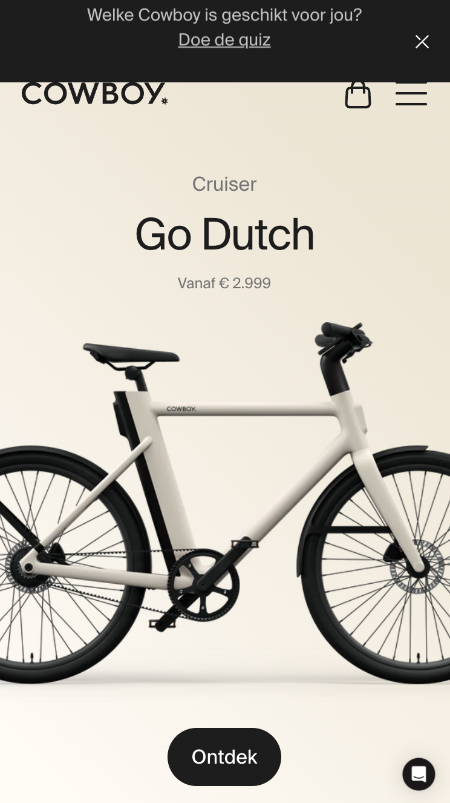
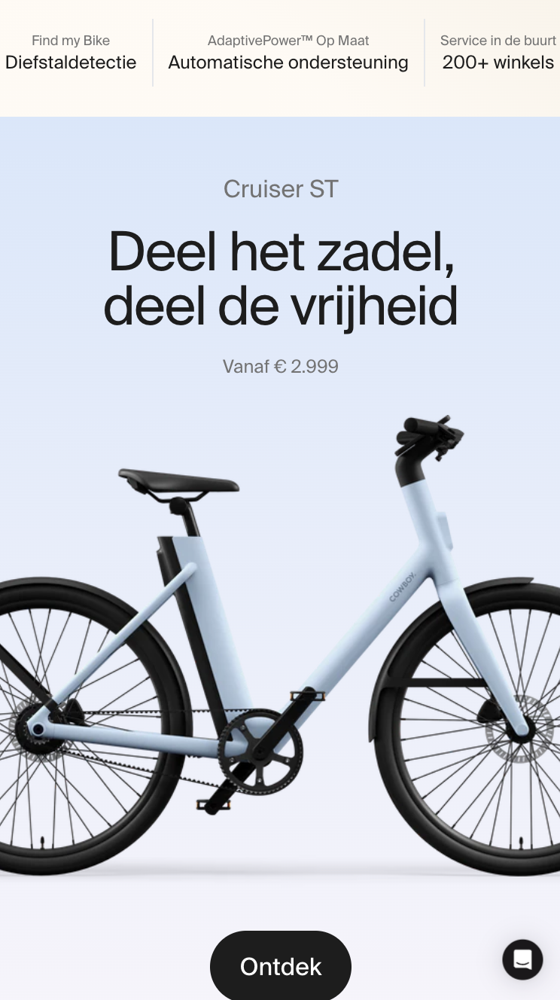
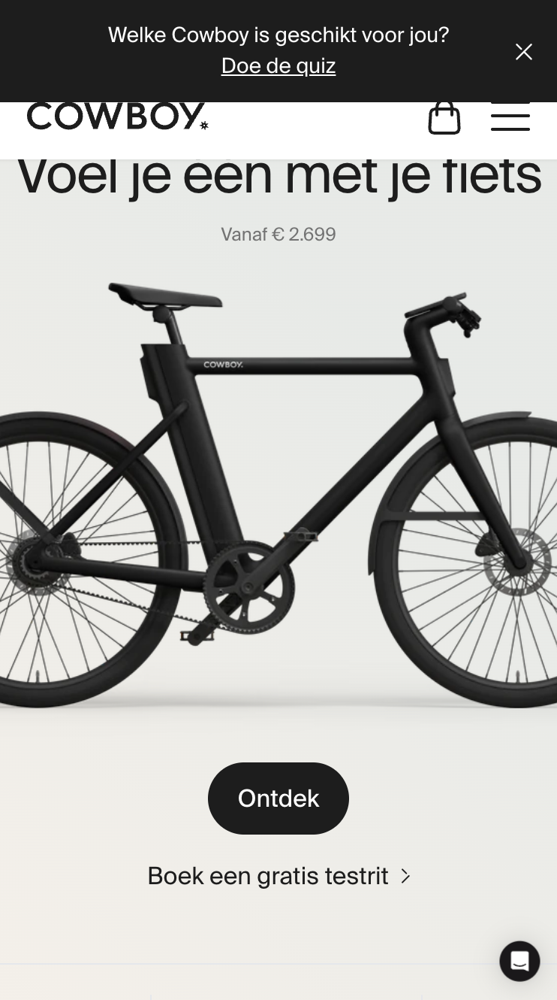
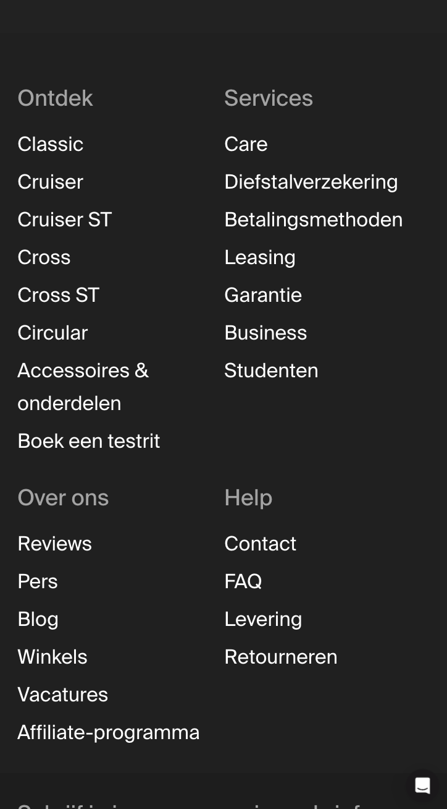

#### Screenshot(s) van de tweede pagina (small screen):

Back to school
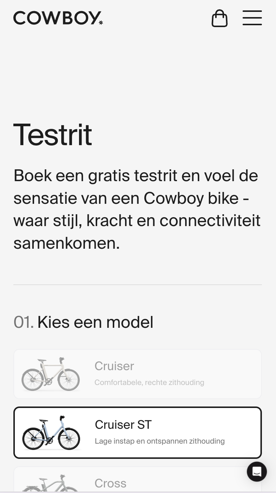
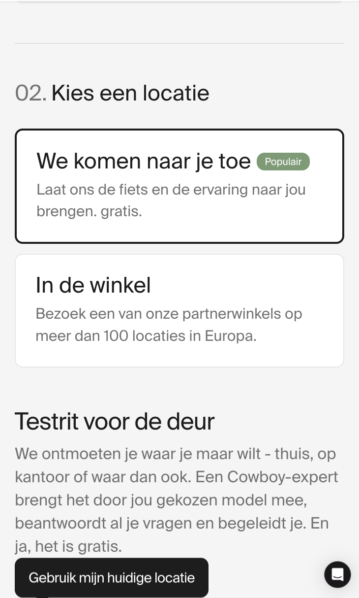
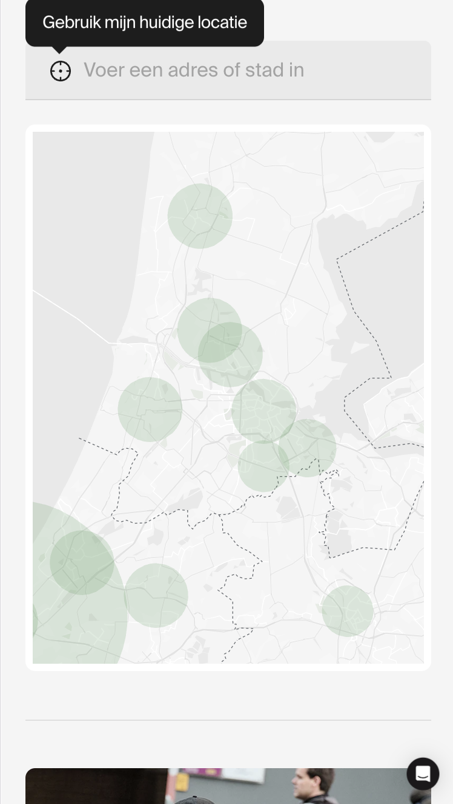

## Toegankelijkheidstest 1/2 (week 1)

  
uitwerken na test in 2e werkgroep

### Bevindingen

Lijst met je bevindingen die in de test naar voren kwamen:

- H1 staat niet goed, h2 komt eerst tijdens de screenreader en dat klopt niet

- 2 keer winkelwagen in de navigatie

- H3’s op de site worden door de screenreaders niet goed begrepen, zoals bij “Go Dutch” de screenreader weet niet dat dit een fiets is, dus mensen die de screenreader gebruiken ook niet. Dit geldt voor meerdere H’3 op de site.

- De knoppen zeggen ook niks behalve “ Ontdek “ en niet “Ontdek Go Dutch” zodat je weet over welke fiets het gaat.

- In de drop down menu zie je bij elke “pagina” alleen een a staan, en niet welke fiets dus als screenreader zou je niet kunnen weten welke fiets. Aan mij dus om elke pagina in de dropdown menu ook een individuele naam geven. Dit geldt ook voor de pagina zelf. Er is geen h1 dus de screenreader weet ook niet welke pagina dit is en dus ook niet welke fiets. Ik kan een visual hidden h1 maken of van de fiets titel een h1 maken.

- Je kan wel naar beneden en met tab navigeren maar je ziet het niet echt, dus je weet niet zo goed waar je klikt. Je ziet wel waar is heen gaat in de pagina, maar sommige knoppen zijn ontzichtbaar

Lees meer van mijn bevindingen in de screenshot van de WCAG checklist hieronder.

### screenshots WCAG Checklist

  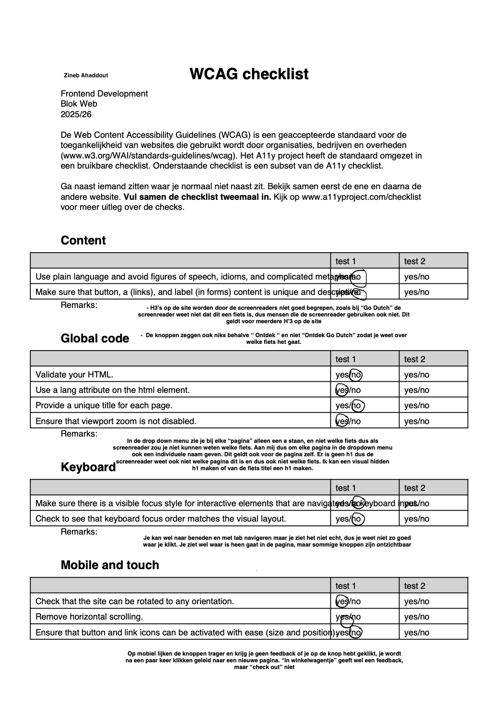
  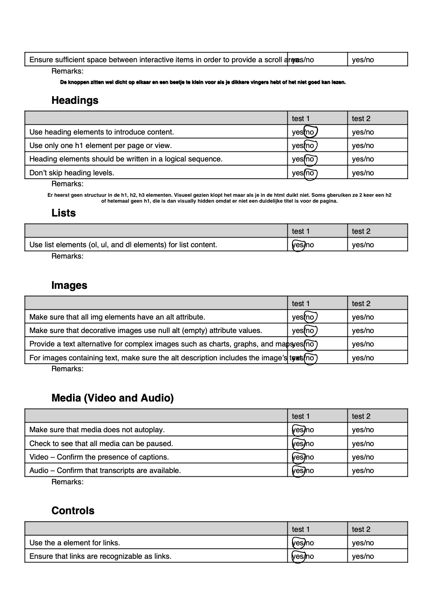
  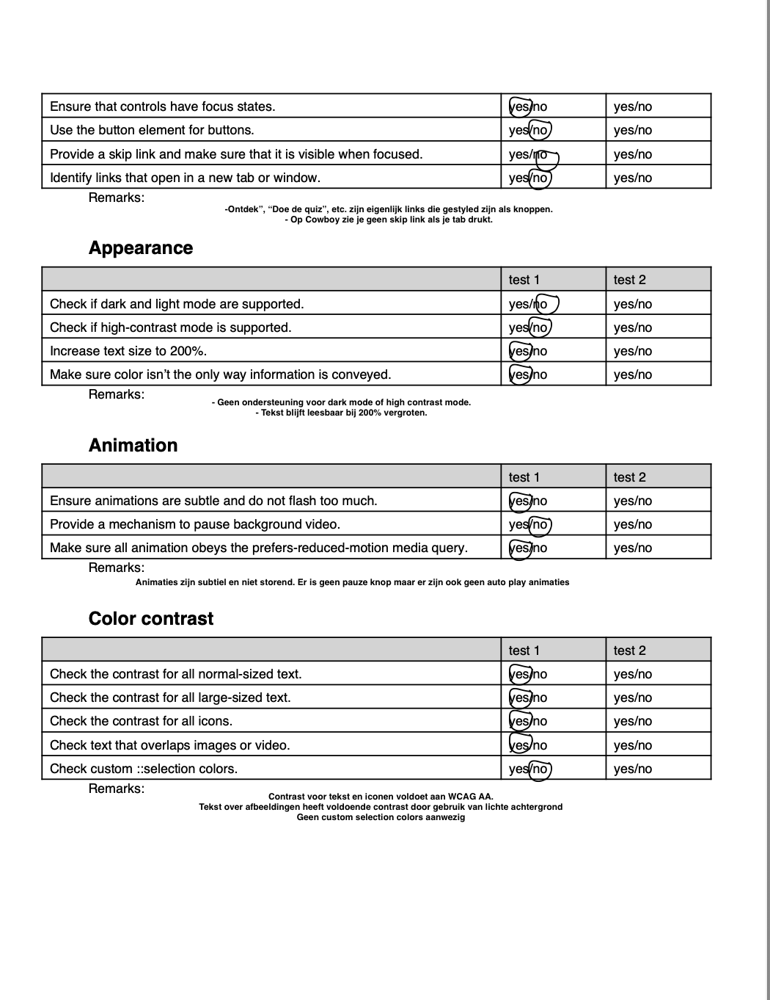

## Breakdownschets (week 1)

  
uitwerken na afloop 3e werkgroep

### homepage:

  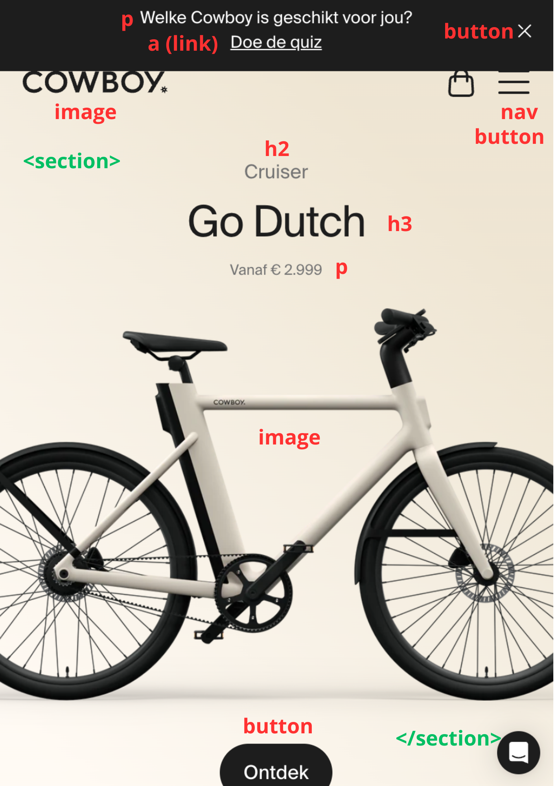

### product:

  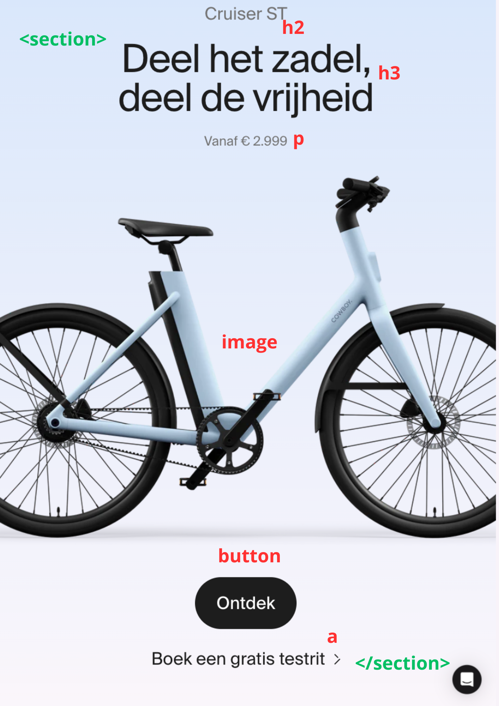

### navigatie - menu:

  

### boek je testrit:

  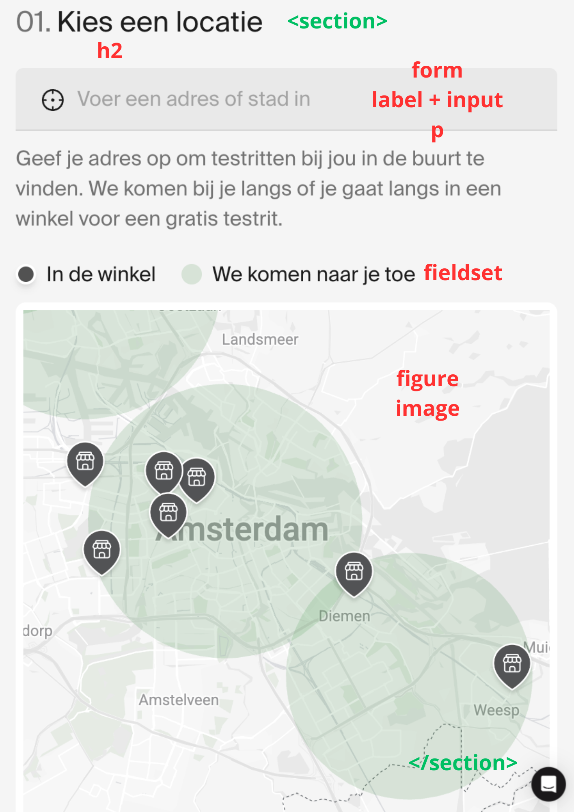

### ontmoet je match:

  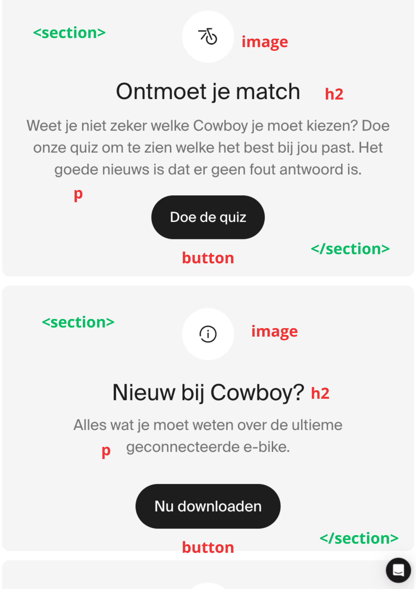

### footer:

  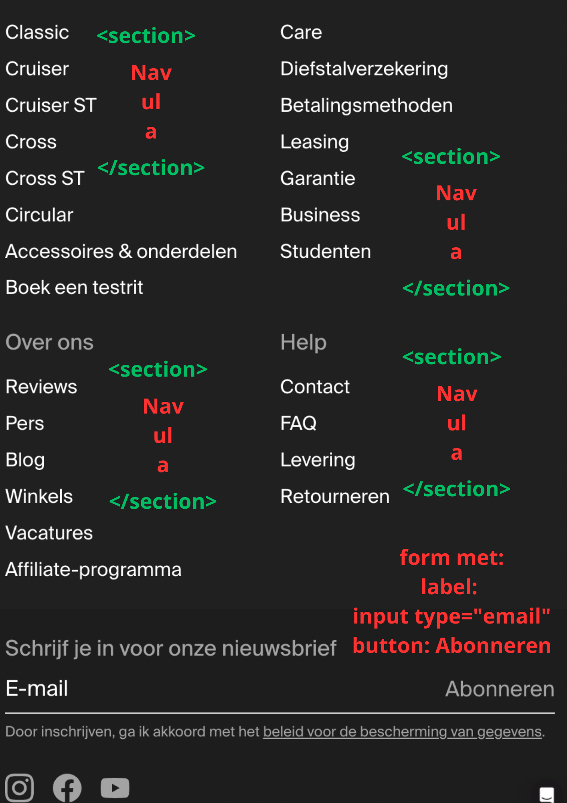

## Voortgang 1 (week 2)

  
uitwerken voor 1e voortgang

### Stand van zaken

hier dit ging goed & dit was lastig (neem ook screenshots op van delen van je website en code)

### Agenda voor meeting

samen met je groepje opstellen

Zineb Ahaddout:

- Hoe kun je iconen downloaden van de site?

- Er bestaat geen h1 op de homepage van Cowboy, ik heb er nu voor gekozen om een visually hidden h1 te kiezen voor de screenreader, maar eigenlijk zou er wel een zichtbare h1 moeten zijn. Dit kan niet Cruiser zijn of Go Dutch, want dan zou Cruiser ST of de andere slogan ook een h1 moeten zijn maar er is maar een h1 op een pagina.

- Wanneer gebruik ik section en wanneer <article?
  → Bijvoorbeeld bij de herhaalde productblokken (Cruiser, Cruiser ST).

- Wanneer gebruik ik figure en figcaption, en wanneer alleen een ”

Bener:

Header is iets wat elke pagina terug komt zoals logo, navi, profiel, winkelwagen

Samya:

Als een foto decoratie is dan moet het in de CSS en alleen als het informatief is dan moet het in de html

Phon:Nav kan ook in de main of in de footer

Detail summery (dat is wanneer je een tabje open klapt)

## Voortgang 2 (week 3)

  
uitwerken voor 2e voortgang

### Stand van zaken

hier dit ging goed & dit was lastig (neem ook screenshots op van delen van je website en code)

### Agenda voor meeting

samen met je groepje opstellen

| student 1      | student 2          | student 3    | student 4        |
| -------------- | ------------------ | ------------ | ---------------- |
| dit bespreken  | en dit             | en ik dit    | en dan ik dat    |
| en dat ook nog | dit als er tijd is | nog een punt | dit wil ik zeker |
| ...            | ...                | ...          | ...              |

### Verslag van meeting

hier na afloop snel de uitkomsten van de meeting vastleggen

- punt 1
- punt 2
- nog een punt
- ...

## Toegankelijkheidstest 2/2 (week 4)

  
uitwerken na test in 9e werkgroep

### Bevindingen

Lijst met je bevindingen die in de test naar voren kwamen (geef ook aan wat er verbeterd is):

## Voortgang 3 (week 4)

  
uitwerken voor 3e voortgang

### Stand van zaken

hier dit ging goed & dit was lastig (neem ook screenshots op van delen van je website en code)

### Agenda voor meeting

samen met je groepje opstellen

| student 1      | student 2          | student 3    | student 4        |
| -------------- | ------------------ | ------------ | ---------------- |
| dit bespreken  | en dit             | en ik dit    | en dan ik dat    |
| en dat ook nog | dit als er tijd is | nog een punt | dit wil ik zeker |
| ...            | ...                | ...          | ...              |

### Verslag van meeting

hier na afloop snel de uitkomsten van de meeting vastleggen

- punt 1
- punt 2
- nog een punt
- ...

## Eindgesprek (week 5)

  
uitwerken voor eindgesprek

### Je uitkomst - karakteristiek screenshots:

  

### Dit ging goed/Heb ik geleerd:

Korte omschrijving met plaatjes

  

### Dit was lastig/Is niet gelukt:

Korte omschrijving met plaatjes

  

## Bronnenlijst

  
continu bijhouden terwijl je werkt

Nb. Wees specifiek ('css-tricks' als bron is bijv. niet specifiek genoeg).
Nb. ChatGpT en andere AI horen er ook bij.
Nb. Vermeld de bronnen ook in je code.

1. bron 1
2. bron 2
3. ...

FED PLANNING

    - [ ] HTML
        - [ ] Home
            - [ ] Svg’s van cowboy overnemen en in de website plaatsen.
            - [ ] Maak taal zonder klikbaarheid
        - [x] Testrit
    - [ ] Css
        - [ ] Globale css
        - [ ] Home
        - [ ] Testrit
            - [ ] Radio fiets keuze highlighten.
    - [ ] Javascript
        - [ ] Menu
    - [ ] Verslag
        - [ ] Opschrijven wat je zou maken als je meer tijd hebt bv. Google maps stylen
    - [ ] WGAC (Alles hercontroleren ook alles wat yes)
        - [ ] Alle No’s fixen
        - [ ] Screen reader test
    - [ ] Wensen lijstje (als tijd en zin over)
        - [ ] Balk bovenin
            - [ ] Wegklikbaar
            - [ ] Texten die Veranderen
        - [ ] Kaart

